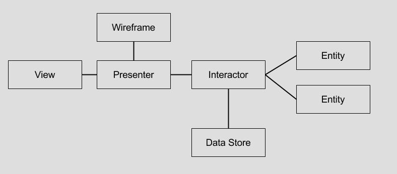

# VIPER架构简单说明
苹果的设计最初就是按照MVC的模式进行划分，Model-View-Controller，但是大多数的没有经过架构规划的项目中，UIController里面随着业务逻辑的不断累积，经常会变得非常臃肿，MVC经常也就笑称为Massive-View-Controller。无论是对于多人协作开发、后期维护以及调试测试都是非常麻烦的事情，因此业内也出现了很多瘦Controller的理念和方案，比如我们经常所听到的MVP、MVVM等等，这里我想讲一讲VIPER。VIPER起源于[Clean Architecture](https://8thlight.com/blog/uncle-bob/2012/08/13/the-clean-architecture.html)，我先看一下VIPER的架构图：

- View视图，用户界面显示以及用户事件的收集和转发，并非是UIView及其子类，通常包含但不限于UIView、UIViewController。

- Interactor层，进行核心业务逻辑的处理，以User Case的形式请求数据以及完成相应的业务逻辑。

- Presenter展示层，主要处理用户事件，从Interactor层获取原始数据，然后转换成界面逻辑数据以便View层进行显示。另外，路由器Router一般是在Presenter中，以进行路由的操作。

- Entity层，最纯粹的实体对象，供Interactor使用，不包含任何业务逻辑。

- Router路由器，进行视图的跳转，决定了以何种顺序进行哪个界面的显示。注意，这里的Router对象是绑定注入的方式，不能设计成直接跳转。

# Arch_viper_SingleDataFlow

此demo为VIPER单向数据流向的实现, 比较符合我们目前的项目场景。

## 总结
在真正的项目实战中，我们需要考虑更多的问题，比如：

1. VIPER核心接口抽象，VIPER的分层需要定义接口protocol来具体抽象每一个层，来建立一套VIPER架构体系，完成每一层的特定功能、规约数据流向，以达到项目中对开发人员的约束。
2. VIPER的层与层之间的访问交流规则制定，需要依赖于抽象；层与层之前进行数据流转的时候，使用ViewModel解偶数据依赖，另外对于View层的事件和数据源也可以进一步拆分，
3.对于业务实体，必须是纯粹的，没有任何业务代码，如POJO对象、DataStore(Local，Network)。
4. VIPER架构每一层是独立的，因此需要一定绑定器使用DI的方式来将他们动态地结合在一起，完成初始化整个模块，配置VIPER之间的关系，并对外声明模块需要的依赖，让外部执行注入。
5. 每一个业务块的VIPER结构是一个独立模块（带UI模块和不带UI的模块），UI模块是基于事件触发的，他们之间可以使用Router进行跳转；非UI模块的访问可以使用service，Service由业务流程在执行路由时注入到Builder，再由Buidler注入到Interactor。也可只注入一个Service Router，运行时通过这个Service Router懒加载需要的Service，相当于注入了一个提供Router功能的Service。
6. 对于传统的mvc的项目进行重构时，我们如何快速的映射到viper：
* 整理UIController里面的代码
* 将viper的职责，先将代码分拆，然后再挪到VIPER各个角色中去, 各个层直接调用
* 最后抽象出各个层的接口，完成解藕

## 略有所思
1. 架构设计一定要结合自己实际的业务场景来进行设计，其过程往往是学习新架构--->套用--->解决冲突--->再设计。
2. 所谓的分层，其实都是抽象的分层，比如View层并不能简单理解为就是View+UIController！具体每一层的抽象程度需要根据业务的大小以及复杂来确定。
3. 关于Interactor，Interactor是基于application分层的user case，Interactor业务代码的纯粹性，决定着复用、版本移植以及多平台使用的难易程度。
4. 对presenter，处理UI界面的事件和完成UI数据源的转换给界面显示或者完成界面跳转。presenter是view和interactor的桥，一般情况下是不允许view和interactor直接进行交流的，凡事也要根据具体项目来看。

##  参考: 
Tangentw的《探究在iOS开发中实现VIPER架构》, (http://www.jianshu.com/p/a901de9c7eaf) ,swift版本。 
Architecting iOS Apps with VIPER, (https://www.objc.io/issues/13-architecture/viper/)
